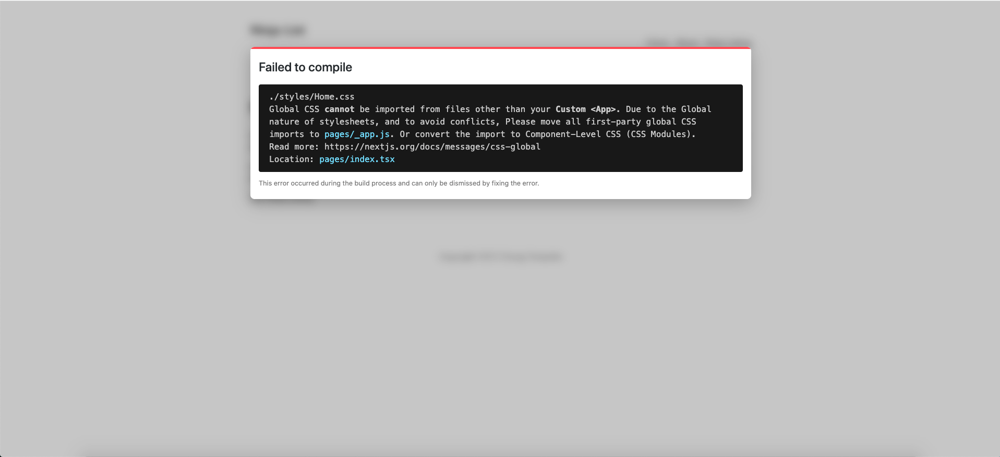

- [Document](#document)
- [Git Repository](#git-repository)
- [What is Nextjs](#what-is-nextjs)
  - [SSG & SSR Benefits](#ssg--ssr-benefits)
- [Next.js Tutorial #2 - Pages & Routes](#nextjs-tutorial-2---pages--routes)
- [Next.js Tutorial #3 - Adding Other Components](#nextjs-tutorial-3---adding-other-components)
- [Next.js Tutorial #4 - Linking Between Pages](#nextjs-tutorial-4---linking-between-pages)
- [Next.js Tutorial #5 - Creating a Layout Component](#nextjs-tutorial-5---creating-a-layout-component)
- [Next.js Tutorial #6 - Adding Styles](#nextjs-tutorial-6---adding-styles)
- [Next.js Tutorial #7 - Custom 404 Page](#nextjs-tutorial-7---custom-404-page)
- [Next.js Tutorial #8 - Redirecting Users](#nextjs-tutorial-8---redirecting-users)
- [Next.js Tutorial #9 - Images & Metadata](#nextjs-tutorial-9---images--metadata)
- [Next.js Tutorial #10 - Fetching Data (getStaticProps)](#nextjs-tutorial-10---fetching-data-getstaticprops)
- [Next.js Tutorial #11 - Dynamic Routes (part 1)](#nextjs-tutorial-11---dynamic-routes-part-1)
  - [What nextjs working with static site generation](#what-nextjs-working-with-static-site-generation)
- [Next.js Tutorial #12 - Dynamic Routes (part 2 - getStaticPaths)](#nextjs-tutorial-12---dynamic-routes-part-2---getstaticpaths)
- [Viewing](#viewing)
  
# Document
https://www.youtube.com/watch?v=A63UxsQsEbU&list=PL4cUxeGkcC9g9gP2onazU5-2M-AzA8eBw

# Git Repository
https://github.com/iamshaunjp/nextjs-tutorial

# What is Nextjs
- Framework for creating pre-rendered React websites
- Offers us both Server Side Rendering (SSR) & Static Site Generation (SSG)

Nextjs it's a react framework that allows us to create pre-rendered react websites whether that be via server-side rendering or static site generation. Server-side rendering is when react components are rendered into html pages on the server after a page request comes from the browser and static site generation is when components are rendered into html pages at build time so that we can just deploy the web pages and javascript bundles to the web and nextjs allows us to easily do both of these things meaning that our react components are already rendered into html pages by the time they reach the browser now from that point onwards the application can behave more like an spa a single page application in the all routing can be handled on the client side in the browser now in contrast to this without next react renders components in the browser instead and this is known as client-side rendering. Now the benefits of server-side rendering and static site generation are that firstly it can improve a website's performance because components are pre-rendered meaning less work in the browser and secondly it results in better seo than traditional single page applications because the response from the server is a fully rendered html page rather than just a blank one which is what would be returned in a regular react application without next so in the eyes of search engine crawlers it makes our site much more palatable.

## SSG & SSR Benefits
- Pre-rendering improves performance
- Better Search Engine Optimization (SEO)

# Next.js Tutorial #2 - Pages & Routes
https://www.youtube.com/watch?v=zktJ8-k0JDc&list=PL4cUxeGkcC9g9gP2onazU5-2M-AzA8eBw&index=2

# Next.js Tutorial #3 - Adding Other Components
https://www.youtube.com/watch?v=MJT_WXdSPjE&list=PL4cUxeGkcC9g9gP2onazU5-2M-AzA8eBw&index=3

# Next.js Tutorial #4 - Linking Between Pages
https://www.youtube.com/watch?v=u8vaAc3ivcY&list=PL4cUxeGkcC9g9gP2onazU5-2M-AzA8eBw&index=4

# Next.js Tutorial #5 - Creating a Layout Component
https://www.youtube.com/watch?v=DGn25s42NvQ&list=PL4cUxeGkcC9g9gP2onazU5-2M-AzA8eBw&index=5

# Next.js Tutorial #6 - Adding Styles
https://www.youtube.com/watch?v=qKwnlTVAGnA&list=PL4cUxeGkcC9g9gP2onazU5-2M-AzA8eBw&index=6

css folder is located at `styles`.

css global has format name `{name}.css`. css module has format name `{name}.module.css`. Css global only imported at `_app.tsx` file, if not will throw error like this

# Next.js Tutorial #7 - Custom 404 Page
https://www.youtube.com/watch?v=dlee0ESZvlc&list=PL4cUxeGkcC9g9gP2onazU5-2M-AzA8eBw&index=7

# Next.js Tutorial #8 - Redirecting Users
https://www.youtube.com/watch?v=O3yKwz4wRHc&list=PL4cUxeGkcC9g9gP2onazU5-2M-AzA8eBw&index=8

# Next.js Tutorial #9 - Images & Metadata
https://www.youtube.com/watch?v=rHncMH1CfCU&list=PL4cUxeGkcC9g9gP2onazU5-2M-AzA8eBw&index=9

# Next.js Tutorial #10 - Fetching Data (getStaticProps)
https://www.youtube.com/watch?v=zueyEdRZQlk&list=PL4cUxeGkcC9g9gP2onazU5-2M-AzA8eBw&index=10

# Next.js Tutorial #11 - Dynamic Routes (part 1)
https://www.youtube.com/watch?v=WPdJaBFquNc&list=PL4cUxeGkcC9g9gP2onazU5-2M-AzA8eBw&index=11

## What nextjs working with static site generation
1:00 https://www.youtube.com/watch?v=WPdJaBFquNc&list=PL4cUxeGkcC9g9gP2onazU5-2M-AzA8eBw&index=11

Once we've completed developing our application next is going to generate a static site for us based on all of our page components and it's at this point that next renders all of our page components into html files and javascript bundles that go with them for any interactivity on those pages so now we have a load of pages ready to deploy to the web a static site containing just these html pages and javascript so it's going to generate in our case at the minute an index homepage and about page and also the ninjas homepage as well so when it comes to building our ninja details pages it's going to need to generate an html file for each item of data that we have in our case that will be 10 different pages which is how many items we get back from the api endpoint that we're using so it could be this one for forward slash ninjas, `ninjas/1.html`, `ninjas/2.html`, `etc`. The template and the component that we use will be the same for each one of these pages so we don't need to make multiple components for them but next still needs to pre-render a separate page for every single ninja and assign each one its own route so we'll see that in action later on but first of all let's create the ninja details components that these pages are going to be based on so i'm going to make that details component inside the ninjas folder

# Next.js Tutorial #12 - Dynamic Routes (part 2 - getStaticPaths)
https://www.youtube.com/watch?v=mAHqpdVzJmA&list=PL4cUxeGkcC9g9gP2onazU5-2M-AzA8eBw&index=12

# Viewing
2:25 https://www.youtube.com/watch?v=mAHqpdVzJmA&list=PL4cUxeGkcC9g9gP2onazU5-2M-AzA8eBw&index=12